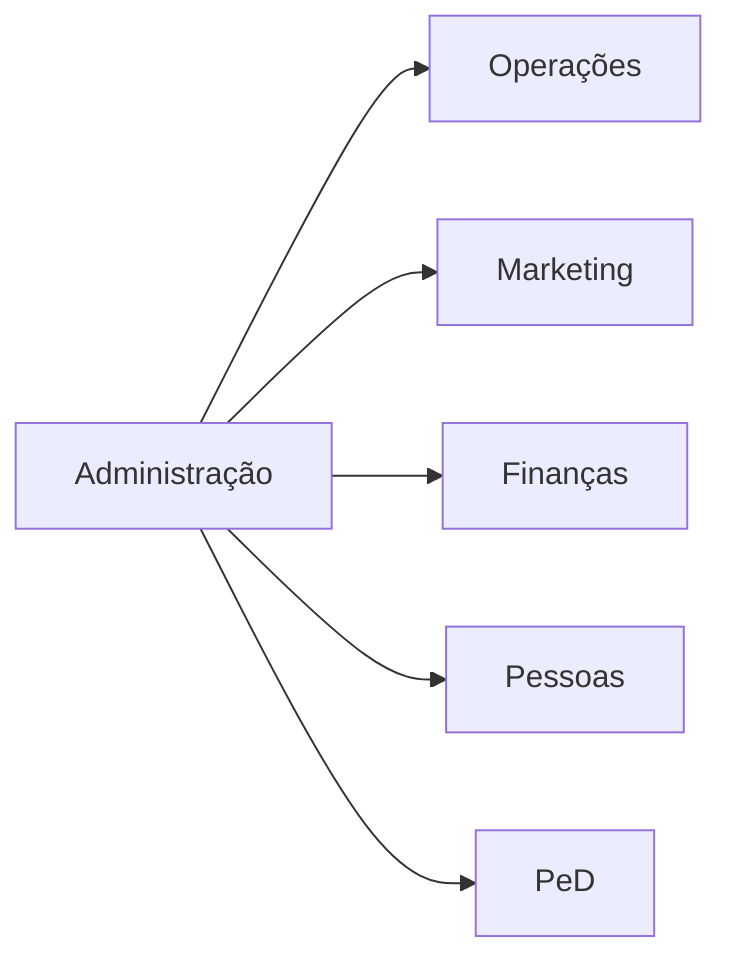

---
{"dg-publish":true,"permalink":"/Conhecimento Técnico/A evolução da administração/","created":"","updated":""}
---

## Administração clássica

## Autoconhecimento

Concentre-se nos pontos fortes, reconheça as fraquezas, agarre as oportunidades e proteja se contra as ameaças.

- Acertividade: objetivo, não prolixo

## Administrar
- Garantir a perpetuação do negócio
- Gerir e organizar os recursos e ambientes
- [[Conhecimento Técnico/Perfil organizacional\|Perfil organizacional]]

### Objetivos
- Eficiência
- Competitividade
- Resultados (Stackeholders)

### Fatores de eficácia-competitividade
- Custo
	- Menos desperdícios
	- Processos bem definidos
		- Redesenho de processos
- Velocidade
	- Tempo dos ciclos no mercado
- Inovação
- Flexibilidade
- Desempenho

### Recursos 
- Produtividade
- Qualidade
- Valor padrão  (benchmarking)

### Decisões
- Levantamento de dados (indicadores)
- Planejamento
- Devem abranger 
	- Aspectos técnicos e subjetivos
	- Moral da equipe
	- Impacto nos processos e na organização
	- Tempo de execução
- Ferramentas da qualidade (Ishikawa, [5W2H](https://docs.google.com/document/d/1uucOy91M5DdkoEGqiyzUXZ3-CcCsWmNR/edit?usp=drivesdk&ouid=116759019732684717172&rtpof=true&sd=true), PDCA)
- A resposabilidade da ação tomada recai sobre uma pessoa
- Grau de familiaridade com o problema
- 

- A cultura não está preparada para determinada tecnologia 
- O uso parcial do sistema torna os dados menos confiáveis, os processos e setores devem estar interligados
- Input parcial no sistema
- ==**Planilha não é sistema**==
- ==Sistemas complexos incentivam o uso de controles paralelos==

# Tópicos relacionados