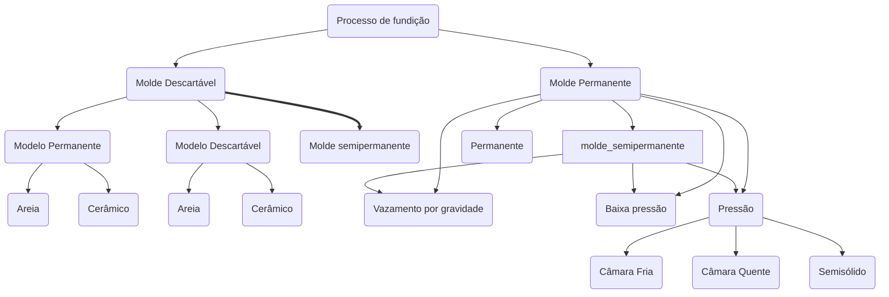

---
{"dg-publish":true,"permalink":"/Conhecimento Técnico/Fundição/","created":"","updated":""}
---

# Tópicos relacionados
[[Conhecimento Técnico/Ferro Fundido\|Ferro Fundido]]

# Generalidades
- Tem o objetivo de conformar uma peça próxima as características finais desejadas
- O material fundido flui por gravidade ou por outra força em um molde
- Conformação por solidificação
- Processo versátil
- Permite a criação de geometrias complexas
- Produção de peças muito pequenas (gramas) ou grandes (>100 ton)
	- Jóias
- Não adequados para produção em série
	- Exceto em injetoras com molde permanente
- Resfriamento natural

## Modelagem
- Feitos de areia ou metal
- Modelagem manual ou automatizada

### Moldes perecíveis
O molde é destruído para que a peça possa ser renovida

### Moldes permanentes
Geralmente metálico
Reutilisável
Necessita inspeções periódicas para manter as dimensões e qualidade

# Taxa de vazamento
- Refere-se a vazão (fluxo) em que o metal é vazado no molde.
- Temperatura e velocidade controlada
	- Rápido: turbulência no fluxo que gera gases que criam porosidades na peça
	- Lento: causa o resfriamento prematuro do metal impedindo que o metal complete o molde
- Calculada com base em ensaios para cada tipo de processo e material
- Deve garantir que ao fim do vazamento parte do metal ainda esteja em estado líquido.
## Turbolência
- Variação críina na magnitude e velocidade do escoamento do fluido
- Acelera a formação de oxidos e erosão no molde

## Fluidez
- Capacidade do metal líquido preencher as cavidades do molde
- Depende dos parâmetros da fundição e do material

## Solidificação
### Metal puro
 - Solidifica a temperatura constante
 #Gráfico  
### Ligas
- Solidificada em determinada faixa de temperatura
#Gráfico

### Tempos de solidificação
- Tempo total após o vazamento para que o metal fundido se solidifique
- Depende do tamanho e forma do molde

$$T_{ts}=C_{m}*\bigg( \frac{V}{a}\bigg)^n$$
$T_{ts}=$
$C_{m}=$
$V=$
$a=$
$n=$
#complete 
### Contração da solidificação
Etapas:
1. Contração do líquido antes da solidificação
2. Contração durante a transformaçao da fase líquida para sólida
3. Contração térmica do fundido solidificado durante o resfriamento até a temperatura ambiente
#Image 

### Dificuldades
- Em casos de moldes com paredes muito finas 
- O fluxo de metal precisa percorrer grandes distâncias
	- Gera perda de carga e de temperatura
	- Aumentar o número de pontos de vazamento pode minimizar o problema

# Projeto do molde
- Detalhamento 
	- Dos dados numéricos
	- Possições dos masalotes
	- Resfriamento
	- Canais de vazamento
	- Respiros

# Areia para moldes
Composiçao:
	- Areia de sílica limpa
		- Tamanho uniforme
		- Alta qualidade
	- Ligas de ferro e aço
	- Ligas de cobre, aço e/ou latão)

## Areia verde
Composiçao:

#complete 

# Classificação do processo

# Processos
- Depende do tamanho, geometria, material, quantidade de peças e qualidade superficial

## Tipos
- Moldagem em areia
- Moldagem em casca
- Shell molding
- Cold box
- Sob pressão
- Fundição de precisão
- Centrífuga
- Alta precisão

# Definições
Metal fundido: lingotes
Fundição das peças: moldagem
Macho: parte do molde colocada na cavidade do molde para extração de partes específicas (partes ocos internas)
Massalote: Reservatório de metal líquido que irá compensar a contração do material da peça quando há a transformação do estado líquido para o sólido -> Mau dimensionamento pode causar vazios (rechute)
Resfriadores: Peça metáliaca que acelera a troca de calor entre o metal e o molde
Respiro: Canal para saída de gases
Canais de vazamento: Dutos que levam o metal fundido até a cavidade molde que irá formar a peça