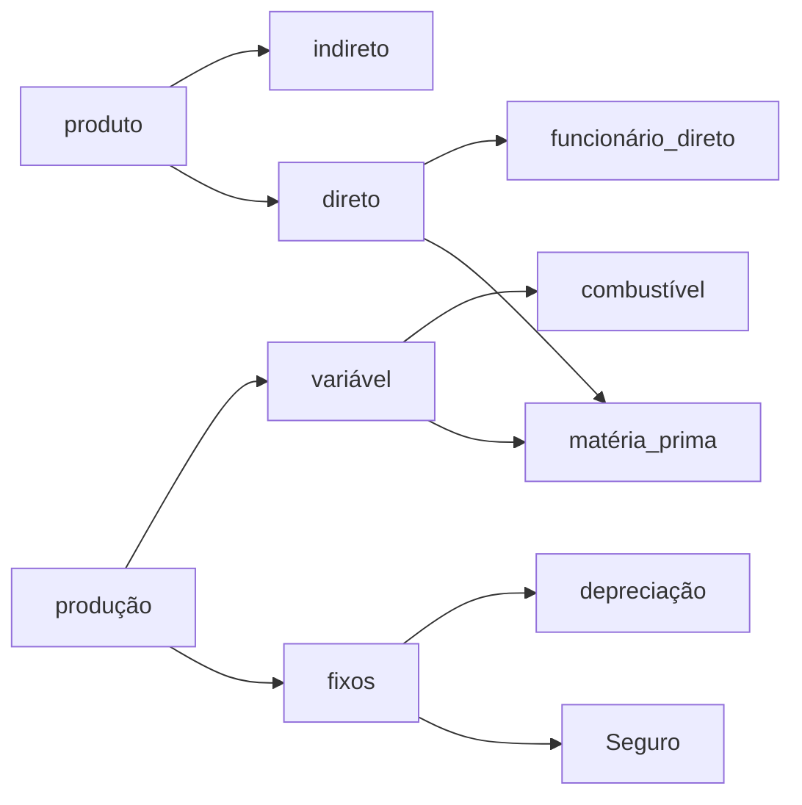

---
{"dg-publish":true,"permalink":"/Conhecimento Técnico/Gestão de custos - Introdução/","created":"","updated":""}
---

## Custos
- Quanto ao produto - [[Conhecimento Técnico/Gestão de custos - Introdução#Custo direto\|#Custo direto]] e [[Conhecimento Técnico/Gestão de custos - Introdução#Custo indireto\|#Custo indireto]]
- Quanto ao volume de produção -  Fixos e variável

### Custo direto
- Relacionados diretamente ao produto e espaço de produção
- "Quem põe a mão"

### Custo indireto
- Relacionado indiretamente ao produto fabricado
- Aluguel
- Luz...
- Supervisor pode ser considerado, faz parte da produção, mas não agrega valor ao produto
- Documentação

## Custo variável
- Varia de acordo com a quantidade produziada

## Custo semi-variável
- Custo que a partir de determinado ponto se torna maior
- Mais custos variáveis
- "Extrapola a capacidade"
- "Funcionários temporários"

## Custo semi-fixo
[[Conhecimento Técnico/Gestão de custos - Introdução#Custo semi-varável\|#Custo semi-varável]] porém com mais custos fixos

## Custo de produção
 - Custo primário
	 - Materia prima
	 - Mão de obra direta

## Custo total
- [[Conhecimento Técnico/Gestão de custos - Introdução#Custo fixo\|#Custo fixo]] + [[Conhecimento Técnico/Gestão de custos - Introdução#Custo variável\|#Custo variável]]

## Despesa
- Administrativas
- Vendas
- Finanças
## Ponto de equilíbrio
- Ponto onde começa o lucro

- Acrescentar o valor de depreciação no custo do produto, para que durante o tempo de depreciação seja possível juntar o capital para que quando o tempo estimado de depreciação seja atingido, tenha-se recurso para a susbtituição

-  Relaciona [[Conhecimento Técnico/Gestão de custos - Introdução#Custos\|#Custos]] e quantidade

## Investimentos

==Vendas internas -> Demanda de um setor sobre o outro fora do procedimento padrão devem ser cobradas sobre o setor solicitante==
# Tópicos relacionados