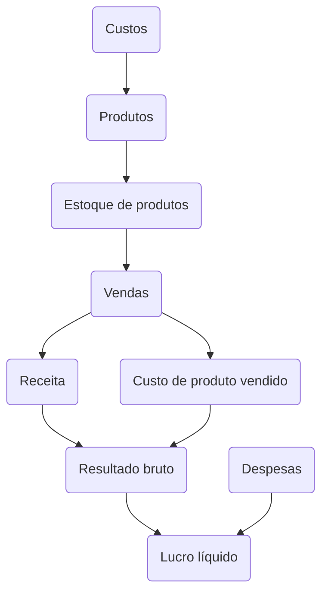

---
{"dg-publish":true,"permalink":"/Conhecimento Técnico/Metodologia de custeio/","created":"","updated":""}
---

# Bp
## Ativo (patrimonio, bens - geração de valor)
- Direito, algo que será recebido como receita ou bem que agregue valor
- Circulante
	- Curto prazo
	- Estoque
	- Despesas antecipadas
- Não circulante
	- Recebimentos a longo prazo
	- Marcas, patentes, softwares
## Passivo (origem do "dinheiro")
- Itens comprados (capital de terceiros)
- Não gera valor para a empresa (financiamento)
- Circulante
	- Dívida
	- Curto prazo
- Não circulante
	- Longo prazo
	- Patrimonio líquido -> posse dos acionistas
# DRE (Demonstrativo resultado do exercício)

$$DRE=R-D$$
$DRE$ = Demonstrativo de resultados do exercício
$R$ = Receita
$D$ = Despesa

## Lucro líquido ($L_l$)

$$L_{l}=DRE+R_{b}-I_{v}-A-C_{pv}-D-I_{l}$$
$L_{l}$ = Lucro líquido
$DRE$ = Demonstrativo de resultado do exercício 
$R_{b}$ = Receita bruta
$I_{v}$ = Imposto sobre vendas
$A$ = Abatimentos
$C_{pv}$ = Custo de produtos vendidos
$D$ = Despesas
$Il$ = Imposto sobre lucro
# [[Conhecimento Técnico/Metodologia de custeio - Absorção\|Absorção]]

<a class="markdown-embed-link" href="/conhecimento-tecnico/metodologia-de-custeio-absorcao/" aria-label="Open link"><svg xmlns="http://www.w3.org/2000/svg" width="24" height="24" viewBox="0 0 24 24" fill="none" stroke="currentColor" stroke-width="2" stroke-linecap="round" stroke-linejoin="round" class="svg-icon lucide-link"><path d="M10 13a5 5 0 0 0 7.54.54l3-3a5 5 0 0 0-7.07-7.07l-1.72 1.71"></path><path d="M14 11a5 5 0 0 0-7.54-.54l-3 3a5 5 0 0 0 7.07 7.07l1.71-1.71"></path></svg></a>

# Generalidades
- Custos (diretos e indiretos) e despesas do período apurado se apropriados ao produto
- Método utilizado pela receita federal para cobrança do IR (Imposto de Renda)
- Considera produtos vendidos, em estoque e em produção

**Investimentos**: São tratados como ativos
**Custos**: São apropriados aos produtos
**Despesas**: Incluídas no DRE (Demonstrativo de resultado do exercício) por não serem diretamente ligados ao produto, porém devem ser considerados na venda.
**Gastos**: Relacionados ao processo produtivo são tratados como despesas

<a class="markdown-embed-link" href="/conhecimento-tecnico/formulas-metodologia-de-custeio-variavel/#resultado-liquido-r-l" aria-label="Open link"><svg xmlns="http://www.w3.org/2000/svg" width="24" height="24" viewBox="0 0 24 24" fill="none" stroke="currentColor" stroke-width="2" stroke-linecap="round" stroke-linejoin="round" class="svg-icon lucide-link"><path d="M10 13a5 5 0 0 0 7.54.54l3-3a5 5 0 0 0-7.07-7.07l-1.72 1.71"></path><path d="M14 11a5 5 0 0 0-7.54-.54l-3 3a5 5 0 0 0 7.07 7.07l1.71-1.71"></path></svg></a>

# Resultado líquido ($R_{l}$)
$R_{l} = M_{c}-CD_{f}=R_{b}-D$

$R_{l}$ = Resultado líquido
$M_{c}$ = Margem de contribuição
$CD_{f}$ = Custos e despesas fixos
$R_{b}$ = Resultado bruto
$D$ = Despesas 
# Tópicos relacionados
[[Conhecimento Técnico/Exercício - Metodologia de custeio - Absorção\|Exercício - Metodologia de custeio - Absorção]]
[[Conhecimento Técnico/Fórmulas - Metodologia de custeio - absorção\|Fórmulas - Metodologia de custeio - absorção]]

# Variável
- Variável entra como margem de contribuição
- Matéria prima e mão de obra = custo variável

$$CD_{f}=C_{f}+D$$
$CD_{f}$ = Custos e despesas fixas
$C_{f}$ = Custos fixos
$D$ = Despesas

[[Conhecimento Técnico/Exercício - Metodologia de custeio - Variável\|Exercício - Custeio variável]]
## Departamentalização
- Unidade mínima administrativa, representado por pessoas e máquinas em que desenvolvem atividades homogêneas
- Cada departamento é um centro de custo (CC)
- O centro de custos acumula os custos indiretos
- O custo indireto depende do gasto do departamento
# Tópicos relacionados
[[Conhecimento Técnico/Gestão de custos - Introdução\|Gestão de custos - Introdução]]
[[Conhecimento Técnico/Exercício - Metodologia de custeio - Absorção\|Exercício - Metodologia de custeio - Absorção]]

