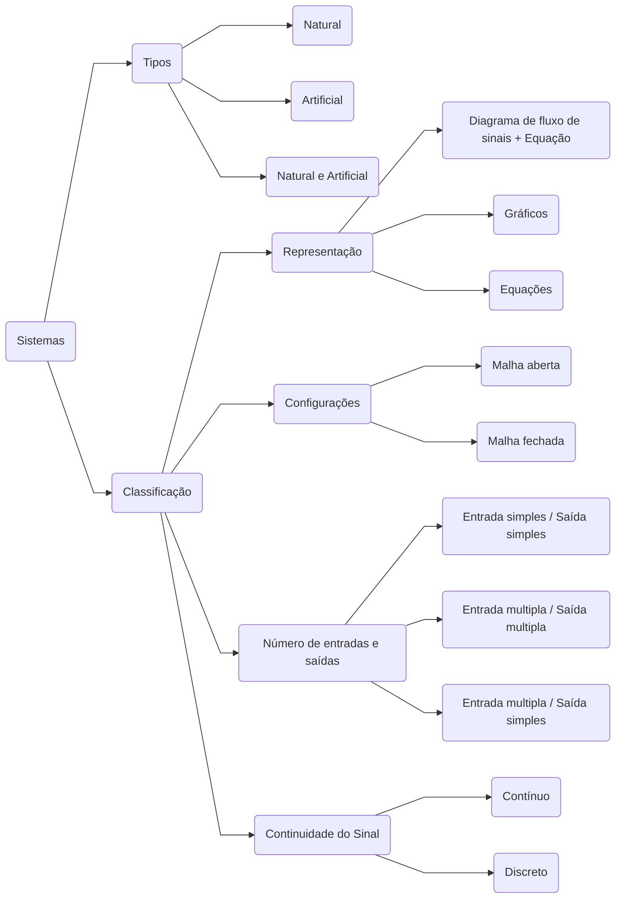

---
{"dg-publish":true,"permalink":"/Conhecimento Técnico/Modelagem e Controle de Sistemas/","created":"","updated":""}
---

# Tópicos relacionados

# Generalidades
- Visualiza um sistema de automação de forma gráfica ou de equação.
- Facilita o entendimento dos sistemas de automação.
- Minimiza os erros do sistema para o usuário final.
- Sistema projetado para determinar qual o desvio entre o sinal de entrada e o de saída.
	- O desvio deve ser o mínimo possível para tornar o sistema viável;
	- Otimização contínua para ganho de velocidade.

## Tipos de controladores
1. Proporcional;
2. Integral;
3. Derivativo;
4. Proporcional-integra (PI)
5. Proporcional-derivativo (PD)
6. Proporcional-integral-derivativo (PID)

