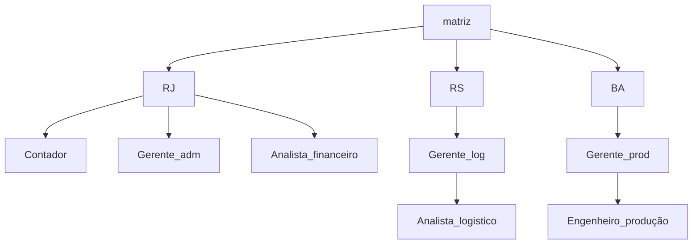

---
{"dg-publish":true,"permalink":"/Conhecimento Técnico/Organograma e fluxograma/","created":"","updated":""}
---

## Organizar
- Designar trabalhos, responsabilidades

# Estrutura organizacional
- Componentes
	- Autoridades
	- Responsabilidades 
	- Comunicaçao
- Condicionanantes
	- Objetivos
	- RH
- Níveis e influência
	- Nível estratégico
	- Nível tático 
- Níveis de abrangência
	- Estratégia de negócios

## Estrutura  informal
- pessoal  e social 

Organograma - representa os sistemas de comunicação 

==Fluxograma em bloco== #Search

# tividadeA
- Empresa com matriz em São Paulo  e 3 filiais (RJ, BA, RS)
- Responsabilidades
	- BA: produçao
	- RJ: comercial
	- RS: distribuição
### Cargos
- 2 gerentes operação
- 4 op. logistica
- 1 gerente adm
- 1 aux. RH
- 1 Analista e RH
- 1 Analista financeiro
- 1 Analista logístico
- 3 Op. maq
- 6 ajudante prod
- 1 contador
- 1 consultor jurídico
- 2 motorista 
- 1 consultor qualidade 
- 1 eng. produçao

![[Organograma.canvas\|Organograma.canvas]]
- # Tópicos relacionados

